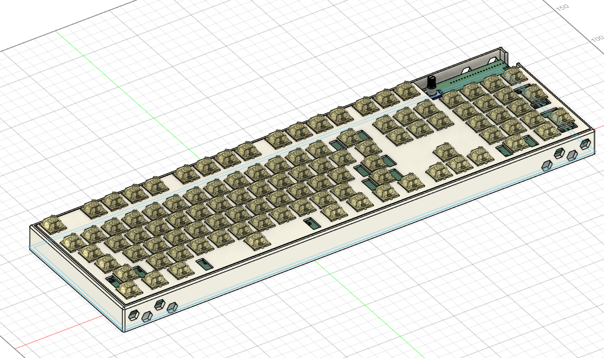
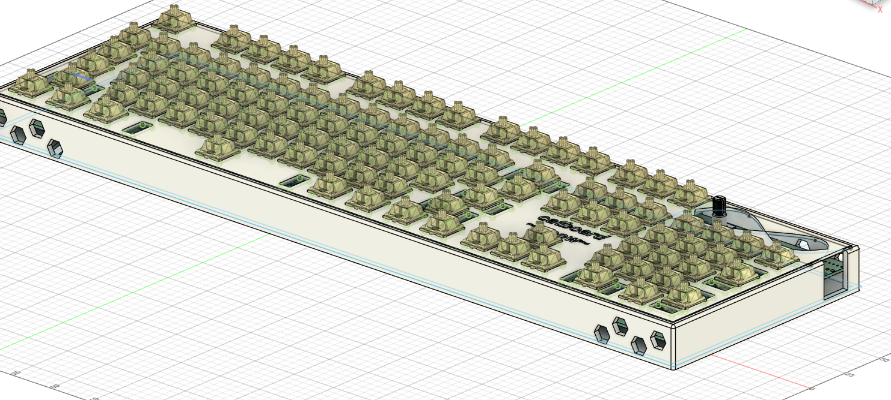
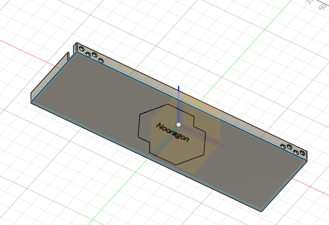
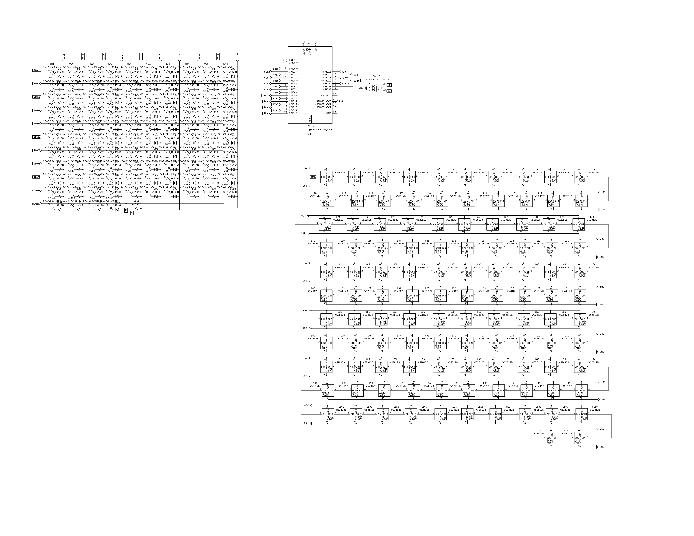

# Noor-s-Cat-Pad
Custim and DIY Keyboard!
#Description
After having a boring ahh keyboard that came with my computer, I needed a new one. I was thinking of buying a keyboard(the one that has led's and looks good) but then I thought that like "Oh. Hackclub exists." so I made one... So since it is very customizable i added a rotary encoder and 104 keys. Is it a bit much? yes. But who cares because I made it anyway. I also made this keyboard hot-swappable, so that I can easily swap switches (mx and kalih) i wanted to switche between clicky and like soft but slightly clicky switches whenever i wanted to.

## Bill of Materials

| Item         | Cost (CAD) | Bought Amount | Notes                      | Link |
|--------------|------------|----------------|-----------------------------|------|
| Switch       | 40.92      | N/A            | 104 Akko Lavender Purple    | https://www.aliexpress.com/i/1005004660950227.html |
| LED          | 10.74      | N/A            | 104 SK6812-mini-E          | https://www.aliexpress.com/i/1005004660950227.html |
| Encoder      | 1.62       | N/A            | EC11                        | https://www.aliexpress.com/item/1005004908084537.html?spm=a2g0o.productlist.main.23.756d0dyL0dyLpG&algo_pvid=5b011c45-a792-49cc-a231-275d92fbcc58&algo_exp_id=5b011c45-a792-49cc-a231-275d92fbcc58-22&pdp_ext_f=%7B%22order%22%3A%2254%22%2C%22eval%22%3A%221%22%7D&pdp_npi=6%40dis%21CAD%215.51%211.62%21%21%2128.02%218.25%21%402101d9ee17552961789493972eea95%2112000030980447520%21sea%21CA%210%21ABX%211%210%21m03_new_user%3A-29895%3Bn_tag%3A-29910%3BpisId%3A5000000174217246&curPageLogUid=300XxStEx47c&utparam-url=scene%3Asearch%7Cquery_from%3A%7Cx_object_id%3A1005004908084537%7C_p_origin_prod%3A |
| Diodes       | 6.83       | N/A            | 105 Diode 1N4148 200mA 100V | https://www.aliexpress.com/item/1005008941642822.html?spm=a2g0o.productlist.main.7.2827455bz4Gyqr&algo_pvid=014dd926-4661-40b6-a5bc-b8d54fad79a3&algo_exp_id=014dd926-4661-40b6-a5bc-b8d54fad79a3-6&pdp_ext_f=%7B%22order%22%3A%222%22%2C%22eval%22%3A%221%22%7D&pdp_npi=6%40dis%21CAD%216.83%216.83%21%21%2134.70%2134.70%21%402101c5ac17552968360663288e0d35%2112000047292922976%21sea%21CA%210%21ABX%211%210%21n_tag%3A-29910%3Bm03_new_user%3A-29895&curPageLogUid=zFktZ6UkPioE&utparam-url=scene%3Asearch%7Cquery_from%3A%7Cx_object_id%3A1005008941642822%7C_p_origin_prod%3A |
| Keycaps      | 35.99      | N/A            | Rome Black Cherry 173 keys | https://www.amazon.ca/dp/B0BN1HT7GC/ref=twister_B0B36XX18J?_encoding=UTF8&th=1 |
| Chip         | 18.87      | N/A            | Raspberry Pi Pico           | https://www.amazon.ca/DIGISHUO-Raspberry-Pi-Pico-Pink/dp/B0CDLDTV19 |
| PCB          | 46.11      | N/A            | JCBPCB Kalih Hotswap        |  |
| kalih Hotswap | 17.99      | N/A            | 106                         | https://www.aliexpress.com/item/1005002653433091.html |
| Stabilizers  | 1.62       | 1 set          |                             | https://www.aliexpress.com/item/1005009141481219.html |
| USB Cable    | 7.76       | N/A            |                             | https://www.aliexpress.com/item/1005007994819567.html |
| Rubber Pads  | 5.00       | N/A            | Local Dollarama             |  |

| Total CAD |
| ------ |
| $193.45 |

