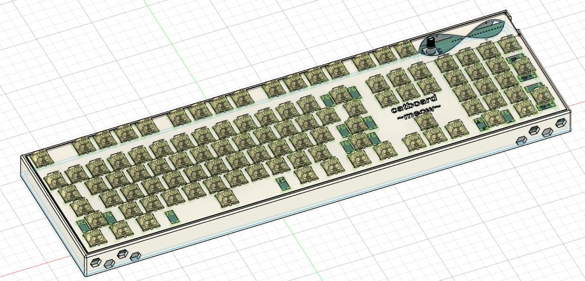

# Noor-s-Cat-Pad
Custim and DIY Keyboard!
#Description
After having a boring ahh keyboard that came with my computer, I needed a new one. I was thinking of buying a keyboard(the one that has led's and looks good) but then I thought that like "Oh. Hackclub exists." so I made one... So since it is very customizable i added a rotary encoder and 104 keys. Is it a bit much? yes. But who cares because I made it anyway. I also made this keyboard hot-swappable, so that I can easily swap switches (mx and kalih) i wanted to switche between clicky and like soft but slightly clicky switches whenever i wanted to.

| Item        | Cost (CAD) | Bought | Amount      | Notes                      | Link                                                                                                                                                                                        |
| ----------- | ---------- | ------ | ----------- | -------------------------- | ------------------------------------------------------------------------------------------------------------------------------------------------------------------------------------------- |
| Switch      | \$40.92    | N/A    | 104         | Akko Lavender Purple       | [AliExpress](https://www.aliexpress.com/i/1005004660950227.html)                                                                                                                            |
| LED         | \$10.74    | N/A    | 104         | SK6812-mini-E              | [Amazon](https://www.amazon.ca/cogae-Similar-WS2812B-Individually-Addressable/dp/B0CYBP7RBR?crid=3CNLQNYJKK06U&keywords=sk6812+mini-e&qid=1749790479&sprefix=sk6812-min%2Caps%2C169&sr=8-2) |
| Encoder     | \$9.49     | N/A    | 1           | EC11                       | [Amazon](https://www.amazon.ca/Bolsen-Rotary-Encoder-Digital-Potentiometer/dp/B07HQD627T/)                                                                                                  |
| Diodes      | \$11.30    | N/A    | 105         | 1N4148 Diodes              | [Amazon](https://www.amazon.ca/Electronic-Conponents-Switching-Rectifier-Isolation/dp/B0CP9LXW6J)                                                                                           |
| Keycaps     | \$35.99    | N/A    | 1 set (173) | Rome Black Cherry 173 keys | [Amazon](https://www.amazon.ca/dp/B0BN1HT7GC)                                                                                                                                               |
| Chip        | \$18.87    | N/A    | 1           | Raspberry Pi Pico (Pink)   | [Amazon](https://www.amazon.ca/DIGISHUO-Raspberry-Pi-Pico-Pink/dp/B0CDLDTV19)                                                                                                               |
| Stabilizers | \$7.39     | N/A    | 1 set       |                            | [AliExpress](https://www.aliexpress.com/item/1005009141481219.html)                                                                                                                         |
| PCB         | \$46.11    | N/A    | 1           | JLCPCB                     |